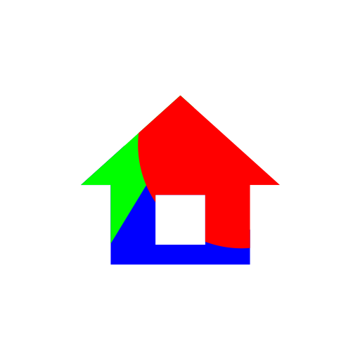

🌐 Language : 🇯🇵 [日本語](.) / 🇺🇸 English

 

#  Soulful Launcher

<!--
#  Soulful Launcher
-->

## Documentation

- [Instructions](instructions_e.html)
- [Privacy Policy](privacy-policy)

## Overview

### A launcher that feels like a "collage."

**Arrange elements freely, just like a collage.**
**A launcher where you intuitively design for usability using icon size and placement.**

### App Features

**【An intuitive home screen that doesn't rely on text】**
Soulful Launcher is an app that lets you create a home screen tailored to your own sense of usability by freely adjusting icon sizes and layering them.
It offers a new user experience where you recognize apps by **"shape" and "location"** rather than by reading text.

**■ Visual organization inspired by the art of collage**
* **Prioritize via visual prominence:** Place frequently used apps prominently by making them larger. You can operate them without hesitation—simply by touching the icon—without needing to read text.
* **Create depth through free layering:** Break free from traditional grid constraints to arrange icons freely, building a layout that is intuitive and easy to tap.
* **Sequential selection for layered icons:** Even when icons are intentionally overlapped, tapping them cycles through the stack, allowing you to consolidate multiple functions in a single spot.
* **Balancing design and practicality:** Let your favorite wallpaper take center stage. By carefully adjusting icon sizes and placement, you can create a highly usable screen that doesn't clutter or obscure your wallpaper's design.
* **Set unique icons:** Use the companion app, [Soulful Icon Generator](../soulful_icon_generator), to create a home screen featuring unique adaptive icons.

**■ Recommended for**
* Those who want clear, easy operation without making the screen feel cramped by enlarging text.
* Those who want to create a stylish screen where the visual appearance of the icons takes the lead.
* Those who want to create a simple operating environment for seniors or beginners—where you can simply say, "Just press the biggest icon."
