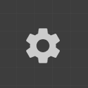
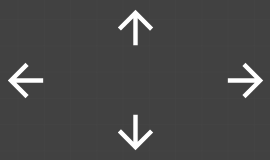

# Soulful Launcher
### Thank you for downloading "Soulful Launcher".

A "collage" style launcher.

Thank you for downloading "Soulful Launcher".

## Introduction (Overview)

App Name: Soulful Launcher
Purpose: Home Collage Launcher

## Brief Description

Arrange freely like a collage.

A launcher that intuitively designs usability with the 'size' and 'position' of icons.

## Operating Environment

Android 12 or later

### Notes

This app is a collage-style launcher app that primarily uses icons.

## Operating Procedure

- When first launched or when no items are registered, the [Settings Menu] (#systemmenu) will be displayed.

- If "Widget Binding Permission" has not been obtained, a permission dialog will be displayed; please grant permission.

### Switching Modes (Normal/Edit)

#### Switching to Edit Mode
- "Edit Home Screen" displayed in the drawer
- Long-press the Home icon to select "Edit Home Screen"

#### Switching to Normal Mode (Ending Edit Mode)
- Tap the [lock icon (top of the overall (vertical) menu)] (#editend) while in edit mode

### Edit Mode
#### Adding Apps to Home
- Long-press the icon in the drawer and drag to add to the home screen
- Tap the icon in the drawer to display "Add to Home" (automatically adds to an empty space)

#### Overall Menu (Vertical)
-  Ending edit mode
-  Changing background color during editing
-  Add Widget…
-  System Settings[…](#systemmenu)
-  Switch items in display order

#### System Settings
##### System
- Standard screen orientation: Portrait/Landscape
- Toggle to show labels
- Toggle to bring items to the foreground
- Toggle to maintain "always on top" setting
##### Support
- Support development
##### Page Management
- Add a new page
- Home settings
- Delete
- Page navigation
#### Item Menu (Landscape)
-  Move Cross Buttons
-  Size Settings...
-  Always on Top
-  Delete Item
-  Finish Selection (Editing) (Confirm)

#### Size Settings
- Size Settings
- Judgment Size
- Icon Size
- Show/Hide Labels

#### Official Website
- [Privacy Policy](https://soulfulsoft.github.io/soulful_launcher/privacy-policy.html) and all inquiries can be found on the [Official Website](https://soulfulsoft.github.io/). ## [Important] Data Backup and Transfer When Changing Devices
- This app is designed not to use a server to protect your privacy. Please check the following points regarding data saving and transfer.

### Data Saving
- All created deployment data, settings, and information on function extensions provided by support are saved on your device.

### Transfer Method When Changing Devices
- Use the standard Android **"Auto Backup (Backup to Google Drive)"** function.
- The following preparations are required to transfer data to a new device.

#### Enable Backup on Your Current Device
- Please check that "Settings" > "Google" > "Backup" on your device is "On".

#### Restore on Your New Device
- Install this app on your new device using the same Google account.
- Data will be automatically restored by the OS.

### Note

#### Real-Time Synchronization Not Supported
- This app does not have a real-time data synchronization function (cloud synchronization) between multiple devices. #### Backup Timing
- Data backups are performed automatically when the Android OS meets conditions such as "connected to Wi-Fi and charging." Therefore, changes made immediately before changing devices may not be reflected.

#### Disclaimer
- Data transfer may not be possible due to use on multiple devices, backup settings, or the effects of previously installed apps.
- Please understand that we cannot provide data recovery or restoration of support status.
